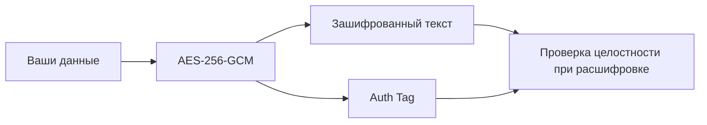
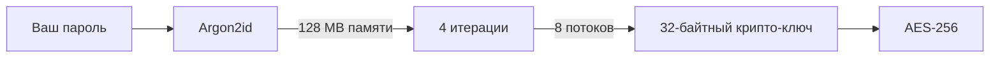

markdown
# 🔐 BloodyKey

> **Локальный инструмент для шифрования текста и файлов военного уровня**

<p align="center">
  
  
  
  
</p>

<p align="center">
  <a href="#-как-запустить">🚀 Запуск</a> •
  <a href="#-как-это-работает-метафора-сейфа">📖 Как работает</a> •
  <a href="#-два-уровня-защиты-мирового-класса">🛡 Безопасность</a> •
  <a href="#-использование">🔐 Использование</a> •
  <a href="#️-технические-детали">⚙️ Технические детали</a> •
  <a href="#-вклад-в-проект">🤝 Вклад</a>
</p>

---

## 📋 О проекте

**BloodyKey** — это клиентский инструмент для шифрования текста и файлов, который превращает ваши секреты в недоступный для посторонних код. Он использует **симметричный метод шифрования**: один и тот же секретный ключ (ваш пароль) используется как для запирания, так и для отпирания «сейфа».

```

🔐 Шифруйте: заметки • пароли • переписку • документы • ключи доступа

```

✅ **Всё работает в браузере** — без серверов, без загрузок, без слежки  
✅ **Пароль никогда не покидает ваше устройство**  
✅ **Открытый исходный код** — проверяйте каждый байт кода  
✅ **Работает офлайн** — после первой загрузки

---

## 🚀 Как запустить?

### 💻 Локально (на своём компьютере)

1. **Скачайте файлы** в одну папку:
   - `index.html` — основной файл приложения
   - `argon2-bundled.min.js` — библиотека Argon2 (WASM)

2. **Откройте в современном браузере**:
   - ✅ Chrome 119+
   - ✅ Firefox 120+
   - ✅ Edge 119+
   - ✅ Safari 17+

3. **⚠️ Важно: требования Web Crypto API**
   
   Из-за требований безопасности браузеров, криптографические функции работают **только в безопасном контексте**:

   | Способ открытия | Работает? | Примечание |
   |----------------|-----------|------------|
   | `https://...` | ✅ Да | Идеально для продакшена |
   | `http://localhost:...` | ✅ Да | Для локальной разработки |
   | `file://...` | ❌ Нет | Браузер заблокирует криптографию |

4. **Быстрый запуск локального сервера**:
   ```bash
   # Вариант 1: через npx (Node.js)
   npx serve .
   # Затем откройте: http://localhost:3000

   # Вариант 2: через Python
   python -m http.server 8000
   # Затем откройте: http://localhost:8000

   # Вариант 3: через PHP
   php -S localhost:8000
   # Затем откройте: http://localhost:8000
```

💡 Совет: если вы просто хотите зашифровать что-то «здесь и сейчас» — используйте онлайн-версию ниже.

---

🌐 Онлайн (GitHub Pages)

После публикации репозитория сайт будет доступен по адресу:

🔗 https://necto4529-droid.github.io/BloodyKey/

```
✅ HTTPS — безопасно
✅ Автообновления — всегда свежая версия
✅ Никакой установки — просто откройте ссылку
```

⚠️ Напоминание: даже в онлайн-версии всё шифрование происходит на вашем устройстве. Сервер не видит ни ваши данные, ни пароль.

---

📱 Мобильные устройства

BloodyKey полностью адаптирован для смартфонов и планшетов:

Платформа Поддержка Примечание
Android (Chrome) ✅ Полная Работает как веб-приложение
iOS (Safari) ✅ Полная Добавьте на главный экран для удобного доступа
Мобильный браузер ✅ Адаптивный интерфейс Кнопки и поля оптимизированы под тач

Как добавить на главный экран (PWA-подобный опыт):

1. Откройте BloodyKey в браузере
2. Нажмите «Поделиться» (iOS) или «⋮» (Android)
3. Выберите «На экран "Домой"» / «Добавить на главный экран»
4. Готово! Приложение будет доступно как иконка 🩸

---

🗝 Как это работает: метафора сейфа

```
┌─────────────────────────────────────────┐
│  📦 Ваши данные                          │
│  ↓                                      │
│  🔐 Замок: AES-256-GCM                   │
│  🔑 Ключ: из пароля через Argon2id      │
│  ↓                                      │
│  🩸 Зашифрованный результат (Base64/.bloody) │
└─────────────────────────────────────────┘
```

🔑 Ключевые принципы:

Принцип Описание
Один ключ Тот же пароль, что зашифровал — расшифрует
Никаких копий Ключ создаётся «на лету» и сразу удаляется из памяти
Уникальность Каждый «сейф» уникален благодаря случайным salt и IV
Целостность Любая попытка подмены данных будет обнаружена

⚠️ Безопасность зависит от вас: даже самый стойкий алгоритм бессилен, если пароль передан небезопасно.

---

📬 Как правильно передавать пароль

❌ ПЛОХО:

```
📧 Отправить зашифрованный текст по Email
📧 И тут же (или следующим письмом) отправить пароль
```

Риск: если почту взломают — злоумышленник получит и «сейф», и «ключ».

✅ ХОРОШО:

```
📧 Зашифрованный файл → отправить по Email
📱 Пароль → отправить через Signal / Telegram / лично / по телефону
```

🪙 Золотое правило:

Канал передачи зашифрованных данных и канал передачи пароля НЕ должны пересекаться.

---

🛡 Два уровня защиты мирового класса

🔒 Уровень 1: Шифрование данных (Сам сейф)

AES-256-GCM — стандарт правительств и банков



Параметр Значение Зачем
Алгоритм AES-256 2²⁵⁶ комбинаций — перебор невозможен
Режим GCM (Galois/Counter Mode) Шифрование + аутентификация в одном
IV 96 бит, случайный Гарантия уникальности каждого шифрования
Auth Tag 128 бит Обнаружение любых изменений в шифротексте

📌 GCM-режим означает: если кто-то изменит хотя бы один бит в зашифрованном тексте — расшифровка неудачна, и вы сразу об этом узнаете.

---

🔑 Уровень 2: Защита ключа (Как создаётся замок)

Argon2id — победитель Password Hashing Competition



Параметр Значение Защита от
Тип Argon2id GPU + ASIC атак
Память 128 МБ Атак на видеокартах
Итерации 4 Брутфорса в реальном времени
Параллелизм 8 потоков Оптимизации на специализированном железе

💡 Почему не использовать пароль напрямую?
Люди выбирают слабые пароли. Argon2id «растягивает» даже MyCat2026! в криптографически стойкий ключ, делая подбор экономически невыгодным.

---

🔐 Использование

🔒 Зашифровать текст

1. Введите надёжный пароль (мин. 12 символов)
2. Напишите или вставьте сообщение
3. Нажмите «Зашифровать»
4. Скопируйте Base64-строку и отправьте получателю
5. Пароль передайте отдельно (другой канал связи)

🔓 Расшифровать текст

1. Вставьте зашифрованную Base64-строку
2. Введите пароль от отправителя
3. Нажмите «Расшифровать»
4. Если пароль верный — увидите исходное сообщение

📁 Работа с файлами

Действие Результат
Зашифровать файл Скачается файл .bloody (версия 3)
Расшифровать файл Выберите .bloody → введите пароль → скачается оригинал
Защита метаданных Заголовок файла также аутентифицирован через AAD

---

⚙️ Технические детали

```yaml
Криптография:
  шифрование: AES-256-GCM
  деривация_ключа: Argon2id
  размер_ключа: 256 бит
  iv_размер: 96 бит
  salt_размер: 256 бит
  auth_tag: 128 бит

Параметры Argon2id:
  time_cost: 4
  memory_cost: 131072 KB  # 128 MB
  parallelism: 8
  hash_length: 32
  type: Argon2id

Формат файла .bloody (v3):
  magic: "BLOO" (0x42 0x4C 0x4F 0x4F)
  version: 0x0003
  params_version: 0x02 (текущий)
  header_size: 7 байт
  salt_offset: 7
  iv_offset: 39
  ciphertext_offset: 51
  overhead: 51 байт

Безопасность:
  хранение_пароля: никогда не сохраняется
  сетевая_активность: отсутствует
  зависимости: argon2-bundled.min.js (WASM)
```

📊 Сравнение с другими решениями

Функция BloodyKey Онлайн-шифраторы Desktop-приложения
🔐 Работает в браузере ✅ ✅ ❌
🌐 Требует сервер ❌ ✅ ❌
💾 Пароль сохраняется ❌ ⚠️ ⚠️
📦 Шифрование файлов ✅ ❌ ✅
🔍 Открытый исходный код ✅ ❌ ✅
📱 Мобильная совместимость ✅ ✅ ❌

---

🔐 Советы по созданию надёжного пароля

✅ Делайте так:

```
• Минимум 12 символов (лучше 16+)
• Комбинируйте: Aa + 123 + !@#
• Используйте фразу-пароль:
  "Кот_В_Сапогах_Ловит_Рыбу_2026!"
• Проверяйте силу пароля в реальном времени
```

❌ Не делайте так:

```
• Даты рождения, имена, клички
• "123456", "password", "qwerty"
• Один и тот же пароль для разных сервисов
• Передачу пароля тем же каналом, что и файл
```

🧪 Проверка силы пароля:

```
[████████░░] 75% — Хороший
[████████████] 100% — Сильный 🔒
```

---

⚠️ Ограничения и рекомендации

Ограничение Рекомендация
🔐 Забыли пароль = потеря данных Храните пароль в менеджере паролей (Bitwarden, KeePass)
🌍 Файлы >500 МБ могут зависнуть Для больших файлов используйте десктоп-версию или разбивайте архив
🔄 Устаревшая версия формата Следите за обновлениями — старые .bloody (v2) поддерживаются, но v1 не совместимы
🧼 Остатки в памяти браузера После работы очистите историю и кэш

---

🧪 Тестирование и верификация

Проверка целостности:

```javascript
// Попробуйте изменить один символ в зашифрованном тексте
// → Расшифровка завершится ошибкой "Неверный пароль или данные повреждены"
// → Это норма: сработала защита целостности AES-GCM
```

Проверка уникальности:

```javascript
// Зашифруйте одно и то же сообщение дважды с одним паролем
// → Результаты будут РАЗНЫМИ
// → Это норма: случайные salt и IV гарантируют уникальность
```

Проверка приватности:

```javascript
// Откройте DevTools → Network
// Зашифруйте/расшифруйте что-либо
// → Никаких сетевых запросов не будет
// → Всё происходит локально
```

---

🤝 Вклад в проект

BloodyKey — проект с открытым исходным кодом. Мы приветствуем:

· 🐛 Отчёты об ошибках и уязвимостях
· 💡 Предложения по улучшению UX и безопасности
· 🌍 Переводы на другие языки
· 🔧 Оптимизации и рефакторинг

🚀 Быстрый старт для разработчиков:

```bash
# 1. Клонируйте репозиторий
git clone https://github.com/yourusername/bloodykey.git

# 2. Запустите локальный сервер
npx serve .

# 3. Откройте в браузере: http://localhost:3000

# 4. Внесите изменения и создайте Pull Request
```

📋 Чеклист перед PR:

· Код проходит линтинг (если добавлен)
· Нет новых уязвимостей (проверено вручную)
· Документация обновлена при изменении API
· Тесты на криптографию проходят (если добавлены)

---

📄 Лицензия

```
MIT License

Copyright (c) 2026 BloodyKey Contributors

Разрешается бесплатное использование, копирование, модификация
и распространение при условии сохранения уведомления об авторских правах.

ПО предоставляется "как есть", без каких-либо гарантий.
```

https://img.shields.io/badge/License-MIT-yellow.svg

---

🙏 Благодарности

· argon2.js — WASM-порт Argon2 для браузера
· Web Crypto API — нативная криптография в браузере
· Сообществу криптографов — за открытые стандарты, которые делают приватность доступной

---

📬 Контакты и поддержка

· 💬 Обсуждение: GitHub Discussions
· 🐛 Баги: Issues
· 🔐 Уязвимости: пишите на security@... (не в публичные issues!)

---

<p align="center">
  <strong>🩸 BloodyKey © 2026</strong><br>
  <em>AES-256-GCM · Argon2id · 128 MB · Parallel 8 · v3</em><br><br>
  <sub>Ваши секреты заслуживают лучшей защиты.</sub>
</p>

---

⚡ Совет напоследок: сохраните эту страницу в закладки или скачайте index.html — так BloodyKey будет доступен даже без интернета. 🔐

```

### Основные исправления в README:

1. **Параметры Argon2id**: память 128 МБ, параллелизм 8 (было 4).
2. **Версия файла `.bloody`** — v3 (0x0003), заголовок 7 байт, соль 32 байта, смещения и overhead обновлены.
3. **Технические детали** в YAML: `memory_cost: 131072 KB`, `parallelism: 8`, версия формата 3, overhead 51 байт.
4. **Упоминания о 256 МБ** заменены на 128 МБ.
5. **Ссылка на GitHub Pages** оставлена ваша.

Теперь README полностью соответствует вашему финальному коду. Вы можете заменить старый файл `README.md` в репозитории на этот.
