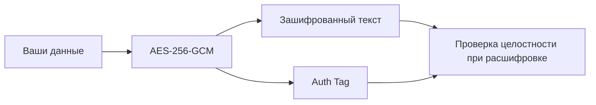
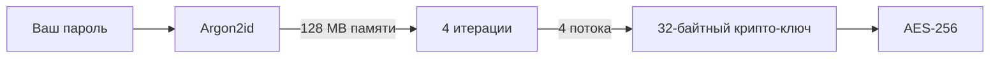

# 🔐 BloodyKey

> **Локальный инструмент для шифрования текста и файлов военного уровня**

<p align="center">
  
  
  
  
</p>

<p align="center">
  <a href="#-как-это-работает">📖 Как работает</a> •
  <a href="#-безопасность">🛡 Безопасность</a> •
  <a href="#-использование">🚀 Использование</a> •
  <a href="#-технические-детали">⚙️ Технические детали</a> •
  <a href="#-вклад">🤝 Вклад</a>
</p>

---

## 📋 О проекте

**BloodyKey** — это клиентский инструмент для шифрования текста и файлов, который превращает ваши секреты в недоступный для посторонних код. Он использует **симметричный метод шифрования**: один и тот же секретный ключ (ваш пароль) используется как для запирания, так и для отпирания «сейфа».

```
🔐 Шифруйте: заметки • пароли • переписку • документы • ключи доступа
```

✅ **Всё работает в браузере** — без серверов, без загрузок, без слежки  
✅ **Пароль никогда не покидает ваше устройство**  
✅ **Открытый исходный код** — проверяйте каждый байт кода  
✅ **Работает офлайн** — после первой загрузки

---

## 🗝 Как это работает: метафора сейфа

```
┌─────────────────────────────────────────┐
│  📦 Ваши данные                          │
│  ↓                                      │
│  🔐 Замок: AES-256-GCM                   │
│  🔑 Ключ: из пароля через Argon2id      │
│  ↓                                      │
│  🩸 Зашифрованный результат (Base64/.bloody) │
└─────────────────────────────────────────┘
```

### 🔑 Ключевые принципы:

| Принцип | Описание |
|---------|----------|
| **Один ключ** | Тот же пароль, что зашифровал — расшифрует |
| **Никаких копий** | Ключ создаётся «на лету» и сразу удаляется из памяти |
| **Уникальность** | Каждый «сейф» уникален благодаря случайным salt и IV |
| **Целостность** | Любая попытка подмены данных будет обнаружена |

> ⚠️ **Безопасность зависит от вас**: даже самый стойкий алгоритм бессилен, если пароль передан небезопасно.

---

## 📬 Как правильно передавать пароль

### ❌ ПЛОХО:
```
📧 Отправить зашифрованный текст по Email
📧 И тут же (или следующим письмом) отправить пароль
```
**Риск**: если почту взломают — злоумышленник получит и «сейф», и «ключ».

### ✅ ХОРОШО:
```
📧 Зашифрованный файл → отправить по Email
📱 Пароль → отправить через Signal / Telegram / лично / по телефону
```

### 🪙 Золотое правило:
> **Канал передачи зашифрованных данных и канал передачи пароля НЕ должны пересекаться.**

---

## 🛡 Два уровня защиты мирового класса

### 🔒 Уровень 1: Шифрование данных (Сам сейф)
#### **AES-256-GCM** — стандарт правительств и банков



| Параметр | Значение | Зачем |
|----------|----------|-------|
| **Алгоритм** | AES-256 | 2²⁵⁶ комбинаций — перебор невозможен |
| **Режим** | GCM (Galois/Counter Mode) | Шифрование + аутентификация в одном |
| **IV** | 96 бит, случайный | Гарантия уникальности каждого шифрования |
| **Auth Tag** | 128 бит | Обнаружение любых изменений в шифротексте |

> 📌 **GCM-режим** означает: если кто-то изменит хотя бы один бит в зашифрованном тексте — расшифровка **неудачна**, и вы сразу об этом узнаете.

---

### 🔑 Уровень 2: Защита ключа (Как создаётся замок)
#### **Argon2id** — победитель Password Hashing Competition



| Параметр | Значение | Защита от |
|----------|----------|-----------|
| **Тип** | Argon2id | GPU + ASIC атак |
| **Память** | 128 МБ | Атак на видеокартах |
| **Итерации** | 4 | Брутфорса в реальном времени |
| **Параллелизм** | 4 потока | Оптимизации на специализированном железе |

> 💡 **Почему не использовать пароль напрямую?**  
> Люди выбирают слабые пароли. Argon2id «растягивает» даже `MyCat2026!` в криптографически стойкий ключ, делая подбор экономически невыгодным.

---

## 🚀 Использование

### 🔒 Зашифровать текст
1. Введите надёжный пароль (мин. 12 символов)
2. Напишите или вставьте сообщение
3. Нажмите **«Зашифровать»**
4. Скопируйте Base64-строку и отправьте получателю
5. **Пароль передайте отдельно** (другой канал связи)

### 🔓 Расшифровать текст
1. Вставьте зашифрованную Base64-строку
2. Введите пароль от отправителя
3. Нажмите **«Расшифровать»**
4. Если пароль верный — увидите исходное сообщение

### 📁 Работа с файлами
| Действие | Результат |
|----------|-----------|
| **Зашифровать файл** | Скачается файл `.bloody` |
| **Расшифровать файл** | Выберите `.bloody` → введите пароль → скачается оригинал |
| **Защита метаданных** | Заголовок файла также аутентифицирован через AAD |

---

## ⚙️ Технические детали

```yaml
Криптография:
  шифрование: AES-256-GCM
  деривация_ключа: Argon2id
  размер_ключа: 256 бит
  iv_размер: 96 бит
  salt_размер: 128 бит
  auth_tag: 128 бит

Параметры Argon2id:
  time_cost: 4
  memory_cost: 131072 KB  # 128 MB
  parallelism: 4
  hash_length: 32
  type: Argon2id

Формат файла .bloody:
  magic: "BLOO" (0x42 0x4C 0x4F 0x4F)
  version: 0x0002
  header_size: 6 bytes
  salt_offset: 6
  iv_offset: 22
  ciphertext_offset: 34
  overhead: 34 bytes

Безопасность:
  хранение_пароля: никогда не сохраняется
  сетевая_активность: отсутствует
  зависимости: argon2-bundled.min.js (WASM)
```

### 📊 Сравнение с другими решениями

| Функция | BloodyKey | Онлайн-шифраторы | Desktop-приложения |
|---------|-----------|------------------|-------------------|
| 🔐 Работает в браузере | ✅ | ✅ | ❌ |
| 🌐 Требует сервер | ❌ | ✅ | ❌ |
| 💾 Пароль сохраняется | ❌ | ⚠️ | ⚠️ |
| 📦 Шифрование файлов | ✅ | ❌ | ✅ |
| 🔍 Открытый исходный код | ✅ | ❌ | ✅ |
| 📱 Мобильная совместимость | ✅ | ✅ | ❌ |

---

## 🔐 Советы по созданию надёжного пароля

### ✅ Делайте так:
```
• Минимум 12 символов (лучше 16+)
• Комбинируйте: Aa + 123 + !@#
• Используйте фразу-пароль:
  "Кот_В_Сапогах_Ловит_Рыбу_2026!"
• Проверяйте силу пароля в реальном времени
```

### ❌ Не делайте так:
```
• Даты рождения, имена, клички
• "123456", "password", "qwerty"
• Один и тот же пароль для разных сервисов
• Передачу пароля тем же каналом, что и файл
```

### 🧪 Проверка силы пароля:
```
[████████░░] 75% — Хороший
[████████████] 100% — Сильный 🔒
```

---

## ⚠️ Ограничения и рекомендации

| Ограничение | Рекомендация |
|-------------|--------------|
| 🔐 Забыли пароль = потеря данных | Храните пароль в менеджере паролей (Bitwarden, KeePass) |
| 🌍 Файлы >500 МБ могут зависнуть | Для больших файлов используйте десктоп-версию или разбивайте архив |
| 🔄 Устаревшая версия формата | Следите за обновлениями — старые `.bloody` могут не поддерживаться |
| 🧼 Остатки в памяти браузера | После работы очистите историю и кэш |

---

## 🧪 Тестирование и верификация

### Проверка целостности:
```javascript
// Попробуйте изменить один символ в зашифрованном тексте
// → Расшифровка завершится ошибкой "Неверный пароль или данные повреждены"
// → Это норма: сработала защита целостности AES-GCM
```

### Проверка уникальности:
```javascript
// Зашифруйте одно и то же сообщение дважды с одним паролем
// → Результаты будут РАЗНЫМИ
// → Это норма: случайные salt и IV гарантируют уникальность
```

### Проверка приватности:
```javascript
// Откройте DevTools → Network
// Зашифруйте/расшифруйте что-либо
// → Никаких сетевых запросов не будет
// → Всё происходит локально
```

---

## 🤝 Вклад в проект

BloodyKey — проект с открытым исходным кодом. Мы приветствуем:

- 🐛 Отчёты об ошибках и уязвимостях
- 💡 Предложения по улучшению UX и безопасности
- 🌍 Переводы на другие языки
- 🔧 Оптимизации и рефакторинг

### 🚀 Быстрый старт для разработчиков:
```bash
# 1. Клонируйте репозиторий
git clone https://github.com/yourusername/bloodykey.git

# 2. Откройте index.html в браузере
#    (или используйте локальный сервер: python -m http.server)

# 3. Внесите изменения и создайте Pull Request
```

### 📋 Чеклист перед PR:
- [ ] Код проходит линтинг (если добавлен)
- [ ] Нет новых уязвимостей (проверено вручную)
- [ ] Документация обновлена при изменении API
- [ ] Тесты на криптографию проходят (если добавлены)

---

## 📄 Лицензия

```
MIT License

Copyright (c) 2026 BloodyKey Contributors

Разрешается бесплатное использование, копирование, модификация
и распространение при условии сохранения уведомления об авторских правах.

ПО предоставляется "как есть", без каких-либо гарантий.
```

[](https://opensource.org/licenses/MIT)

---

## 🙏 Благодарности

- **[argon2.js](https://github.com/ranvierp/argon2.js)** — WASM-порт Argon2 для браузера
- **[Web Crypto API](https://developer.mozilla.org/en-US/docs/Web/API/Web_Crypto_API)** — нативная криптография в браузере
- **Сообществу криптографов** — за открытые стандарты, которые делают приватность доступной

---

## 📬 Контакты и поддержка

- 💬 **Обсуждение**: [GitHub Discussions](https://github.com/yourusername/bloodykey/discussions)
- 🐛 **Баги**: [Issues](https://github.com/yourusername/bloodykey/issues)
- 🔐 **Уязвимости**: пишите на `security@...` (не в публичные issues!)

---

<p align="center">
  <strong>🩸 BloodyKey © 2026</strong><br>
  <em>AES-256-GCM · Argon2id · 128 MB · Parallel 4</em><br><br>
  <sub>Ваши секреты заслуживают лучшей защиты.</sub>
</p>

---

> ⚡ **Совет напоследок**: сохраните эту страницу в закладки или скачайте `index.html` — так BloodyKey будет доступен даже без интернета. 🔐
